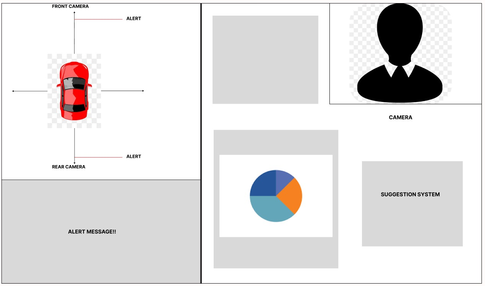

# AI assisted distracted driver detection system

Objective: To design and implement a system that uses AI algorithms to detect distracted driving behaviours in real-time.
 
 
<b>Key Steps:</b>  
Step 1: Data Collection  
Step 2: Model Training and Fine-Tuning  
Step 3: Real-Time Processing  
Step 4: Front-End Development  
Step 5: Backend Development  
Step 6: Dashboard Development  

<b>Takeaways</b>  
We were able to train a Resnet neural network model sucessfully by gathering distracted driver dataset.  
We used ultra-sonic sensors to detect any nearby objects and give an alert to the driver. 
We were sucessful in fetching data from google APIs and recommend nearby hotels for the driver. 
We were able to build a database to store numerical aspects of distracted drivers and analyse the data through pie-charts. 
We tried exploring explainable AI and assist the drivers. 

<b>Block diagram</b>

## Installation and Setup

### Step 1: Clone the Repository
\`\`\`bash
git clone https://github.com/yourusername/satark.git
cd satark
\`\`\`

### Step 2: Set Up the Python Environment
1. **Create a virtual environment (optional but recommended):**
    \`\`\`bash
    python -m venv venv
    source venv/bin/activate  # On Windows use \`venv\Scripts\activate\`
    \`\`\`

2. **Install the required Python packages:**
    \`\`\`bash
    pip install -r requirements.txt
    \`\`\`

### Step 3: Configure MongoDB
1. **Set up a MongoDB Atlas account** if you don't already have one.
2. **Update the MongoDB connection string** in the \`main.py\` file:
    \`\`\`python
    client = MongoClient("your_mongodb_connection_string")
    \`\`\`

### Step 4: Set Up the Ultrasonic Sensors (Arduino)
1. **Connect the ultrasonic sensors** to your Arduino as per the provided code.
2. **Upload the provided Arduino code** (\`ultrasonic_sensor.ino\`) to your Arduino board using the Arduino IDE.
3. **Ensure the correct serial port** is set in the \`main.py\` file:
    \`\`\`python
    serial_port = 'COM6'  # For Windows
    \`\`\`

### Step 5: LocationIQ API Configuration
1. **Get your API key** from [LocationIQ](https://locationiq.com/).
2. **Update the \`locationiq_api_key\` variable** in the \`main.py\` file with your API key.

### Step 6: Run the Flask Application
\`\`\`bash
python main.py
\`\`\`
The application will start on \`http://127.0.0.1:5000/\`.

### Step 7: Access the Application
Open a web browser and go to \`http://127.0.0.1:5000/\` to access the main interface.

## APIs
### Video Feed
- **Endpoint:** \`/video_feed\`
- **Description:** Provides the real-time video feed with drowsiness detection.
- **Parameters:** \`driver_id\` (optional, default: 1)

### Prediction
- **Endpoint:** \`/prediction\`
- **Description:** Returns the current drowsiness detection status.
- **Response:** \`{ 'prediction': 'Drowsiness Detected' | 'Alert' | 'No Eyes Detected' }\`

### Ultrasonic Data
- **Endpoint:** \`/ultrasonic\`
- **Description:** Returns the distance measured by the ultrasonic sensors.
- **Response:** \`{ 'distance1': <value>, 'distance2': <value> }\`

### Current Driving Data
- **Endpoint:** \`/current_driving_data\`
- **Description:** Returns the current driving statistics for the specified driver.
- **Parameters:** \`id\` (optional, default: 1)

### Total Driving Data
- **Endpoint:** \`/total_driving_data\`
- **Description:** Returns the all-time driving statistics for the specified driver.
- **Parameters:** \`id\` (optional, default: 1)

### Fetch Nearby Places
- **Endpoint:** \`/fetch_nearby_places\`
- **Description:** Returns the nearby places of interest.
- **Response:** \`{ 'hotel': [...], 'restaurant': [...], 'hospital': [...] }\`

## Acknowledgements
- Dlib for facial landmark detection.
- Keras for the drowsiness detection model.
- MongoDB for database services.
- LocationIQ for location services.

## Contributing
Contributions are welcome! Please open an issue or submit a pull request.
